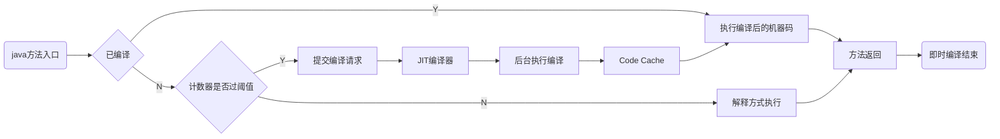
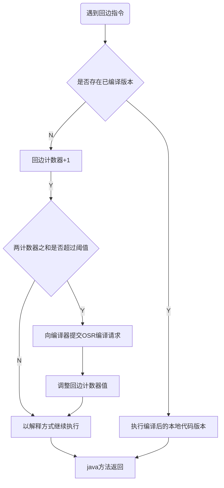

## 执行引擎
 - 执行引擎是虚拟机重要组件之一
 - 虚拟机 是相对于 物理机的概念，物理机的执行引擎是直接建立在处理器，缓存，指令集和操作系统层面上的
 - 虚拟机的执行是有软件自行实现的，不受物理条件的制约制定指令集和执行引擎的结构体系，能够执行不被硬件支持的指令集格式

 - JVM 主要任务是装载字节码文件到其内部，但是字节码并不能够直接运行在操作系统上，字节码指令 不等于 本地机器码指令

 - 执行引擎的任务就是 将字节码指令编译/解释 成本地机器码指令

 - 依赖程序计数器

## 编译和执行过程

- 程序源码 -> 词法分析 -> 单词流 -> 语法分析 -> 抽象语法树 
 - JAVAC 前端编译器

- 抽象语法树 -> 指令流(可选) -> 解释器 -> 解释执行
  - 解释执行过程
  - 当JVM 启动时，会根据预定义的规范对字节码采用逐行解释的方式执行, 将每条字节码文件中内容翻译 为对应平台的本地机器指令执行

- 抽象语法树 -> 优化器 -> 中间代码 -> 生成器 -> 目标代码
  - 编译执行过程
  - JIT(Just In Time Compiler) 编译器：就是JVM 将源代码直接编译成本地机器平台相关的机器语言

## 机器码，指令，汇编语言

#### 机器码
 - 二进制
 - 不容易理解和记忆
 - 执行速度快
 - 和CPU 相关

#### 指令
  - mov, inc
  - 可读性稍好
  - 对应的机器码不同
  - **指令集** : x86, ARM

#### 汇编
  - 助记符， 地址符号， 标号

#### 字节码
  -  是一种 中间码，比机器码更抽象，需要转译成机器码
  - 与平台，硬件无关

## 解释器

- 程序启动时，可以立即响应执行，省去编译时间
- 随着时间的推移，编译器可以发挥作用，获得更高的执行效率
- 解释器在执行编译器优化激进不成立的时候，作为编译器的"逃生门"

### 案理
 - 机器在热机状态可以承受的负载要大于冷机状态，如果以热机状态时的流量切流，可能使处于冷机状态的服务器无法承载流量而假死

## 编译器

- 前端编译器
  - Javac、Eclipse JDT 增量编译器(ECJ)

- Just In Time Compiler ： 字节码转机器码：
  - HotSpot VM C1 C2

- Ahead Of Time Compiler： .java 变成本地机器代码  
  - GNU Compiler for the java(GCJ)
  - Excelsior JET

## 热点代码及探测方式

- 一个被调用多次的方法， 或者是一个方法体内循环次数较多的玄幻提都可以被称之为“热点代码”

- HotSpot VM 采用热点探测方式是基于计数器的热点探测
  - HotSpot VM 会为每一个方法都建立2个不同的类型计数器
  - 方法调用计数器(Invocation Counter): 统计方法调用次数
    - Client:1500 ; Server:10000 除非JIT
    - -XX:CompileThreshold 设定
    - 热度衰减
      - 不是统计绝对次数，而是一个相对执行频率
      - 当超过一定时间限度，方法调用次数不足以让它提交即时编译，那么这个计数器方法会被减少一半，称之为衰减，半衰周期
      - -XX:-UseCounterDecay: 关闭衰减，统计绝对次数
      - -XX:CounterHalfLifeTime :设置半衰周期 秒

  - 回边计数器(Back Edge Counter): 统计循环体执行循环次数
   - 流程图

## 设置参数

- `java -Xint -version` : 解释执行
- `java -Xcomp -version`: 编译执行
- `java -Xmixed -version` : 混合模式

- Client Compiler C1 `-client` 64位系统忽略
  - 简单可靠优化，耗时短。更快的编译速度
  - 方法内联，去虚拟化，冗余消除
  - 方法内联: 将引用的函数代码编译到引用点处，减少栈帧的生成，减少参数传递以及跳转过程
  - 去虚拟化: 对唯一的实现类进行内联
  - 冗余消除: 在运行期间把一些不会执行的代码折叠掉

- Server Compiler C2 `-server` : 64位系统
  - C2 进行耗时较长的优化，以及激进优化，执行效率高
  - 标量替换: 用标量值替代聚合对象的属性值
  - 栈上分配: 对于未逃逸的对象分配对象在栈而不是堆
  - 同步消除: 清除同步操作，通常指**synchronized**

分层编译：
  java7 之后默认开启分层策略， c1 和 c2 协同工作

JDK10 Graal 编译器, 追平 C2
`-XX:+UnlockExperimentalVMOptions -XX:UseJVMCICompiler`
JDK9 AOT: jaotc `.java --> .class --(jaotc)--> .so`
 - 破坏了`一次编译，到处运行`