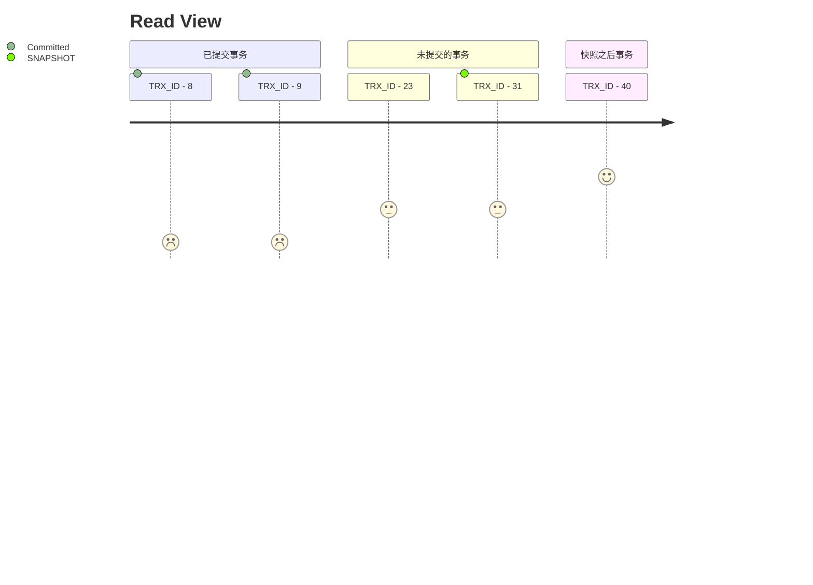

# [MySQL 笔记](https://e.naixuejiaoyu.com/detail/p_60794d2ae4b0d4eb039227b4/6)

[TOC]

## 页是管理单元

- 页头：56 Byte, 
  - 左右页面空间指针，双向链表
  - 页面空间使用情况

- 虚记录：
  - 最小虚记录: 比页内最小主键小
  - 最大虚记录: 比页内最大主键大

- 记录堆：写入数据的空间
  - 行记录存储区，
  - 自由空间链表: 删除的记录组成的链表

- 未分配空间: 未使用的存储空间

- slot: 连续内存，大小一样
- 页尾：8 Byte, 校验信息


## B+ 树

聚簇索引：索引和data 存储在一起
### 顺序保证

- [ ] 物理有序:  数组: 二分查找, 但是插入性能低

- [x] 逻辑有序: 链表: 插入性能好, 查询可以跳表优化

- 链表:  
  slot : 跳表

### 插入策略
- 自由空间链表
  - 提高页空间利用率
- 未使用空间

### 页内查询
- 跳表

## 内存管理

- 预先分配内存
- 以页为单位加载: 从磁盘加载到内存
  - IO效率
  - 相邻数据使用概率大
- 数据内外存交换
  - 不可能加载所有数据
  - 内存不够用
  - 先写(发生变更)后读

### 页面管理
 - 空闲页
 - 数据页
 - 脏页: 内存和磁盘记录不一致, 需要刷盘回写

### 页面淘汰
- LRU: 链表，经常访问的数据放链表头，链表尾自然淘汰

- Clean Page:
- Free List: 空闲Page
- Flush List:  脏页
- Page Hash: 内存Page 和文件 Page 映射关系

### LRU 
new: old 5:3

- LRU_new: 热数据
- LRU_old: 冷数据
- Midpoint: 分隔点

Free List 取空闲页，没有LRU 尾部淘汰，
没有的话，找Dirty Page去LRU Flush


## 锁

链表每次移动需要加锁，所以要减少移动次数

- freed_page_clock: Buffer Pool 淘汰页数
- LRU_new 长度的 1/4

当前 freed_page_clock - 上次移动到Header时的 freed_page_clock
> LRU_new 长度 1/4


## 事务

ACID
- Atomictiy: 全部成功或全部失败
- Isolation：并行事务互不干扰
- Durability: 事务提交后，永久生效

- Consistency: 通过AID 保证

### 并发

### 隔离级别
- 脏读: 读取到其他事务未提交的数据
- 不可重复读: 两次读取结果不同
- 幻读: 两次UPDATE 读取到相同的结果，不管是否提交

| 隔离级别 | 脏读 | 不可重复读 | 幻读 |
| ---: | :---: | :---: | :---: |
|Read Uncommitted | * | *| * |
|Read Committed |  | * | * | 
|Repeatable Read|  | | *|
|Serializable | | | |

### MVCC
 多版本并发控制，

DB_TRX_ID :事务ID, ++1, 值越大，数据越新
DB_ROLL_PTR

- 当前读: 读取存着的数据版本
- 快照读: 读取历史版本

(RR级别)

可见性判断
- 创建快照时，未提交事务
- 创建快照之后的事务

Read View 
- 快照读: 活跃事务(未提交事务)列表
- 列表中最小事务ID
- 列表中最大事务ID



```mermaid

```


### undolog
 - delete undo log: 用于回滚
 - update undo log: 用于回滚，同时实现快照读

 依据系统活跃最小事务ID Read View 清除

InnoDB count(*) 为啥慢

### redolog

实现事务持久性

- 记录修改
- 异常回复
- 循环写文件
  - Write Pos 写入位置
  - Check Point: 刷盘位置
  - Check Point -> Write Pos :待落盘数据

```mermaid
graph TB

  client -- 1 update --> Server
  subgraph MySQL
    Server -- 2 修改数据命令 --> InnoDB
    InnoDB -- 6 跟新完成 --> Server
    Server -- 7 提交 --> InnoDB
  end
  
  InnoDB --3 记录--> UNDOLOG(undo log)
  InnoDB --4 跟新内存数据--> Memory(Memory)
  InnoDB --5 记录prepare --> RedoLog(redo log)
  InnoDB --8 记录commit --> RedoLog

  ```

- 刷盘时机
  - innodb_flush_log_at_trx_commit

```mermaid
sequenceDiagram
participant Buffer Pool
participant Log Buffer
participant OS Buffer

Note over Buffer Pool, OS Buffer: 内存

participant Log Files
Note over Log Files: 磁盘


par 0:性能最好
Buffer Pool ->> Log Buffer : commit
Log Buffer ->> Log Files: 每秒写文件并刷盘
and 1: 性能最差
Buffer Pool ->> Log Files: commitm每次提交并刷
and 2: 丢失一秒数据
Buffer Pool ->> OS Buffer : commit 每次提交时写文件
OS Buffer ->> Log Files: 每秒刷盘
end
```


- 体积小， 记录页的修改，比写入页代价低 (内存页交换)
- 末尾追加，随机写变顺序写，发生改变的页不固定

## 数据锁

- 粒度
  - 行级锁
    - 作用在索引上:  DELETE FROM USER WEHRE phone =123
    - 聚簇索引和二级索引
  - 表级锁 : 更新未命中索引
  - 间隙锁
- 类型
  - 共享锁：读锁
  - 排他锁：写锁

当前读 加排他锁, 用于更新记录
- SELECT ... FOR UPDATE
- UPDATE
- DELETE

- RC 隔离级别, 非唯一索引
  - 使用行级锁
  - 会幻读
  - DELETE

- RR 隔离级别, 非唯一索引
  - 使用 间隙锁
  - 锁住两条记录之间的GAP,解决幻读
  - 保证两次当前读返回一致的记录
  - 不让插入满足条件的记录

  
### 死锁
- T1: UPDATE t_user SET XX=XX WEHRE naem = 'f'
- T2: SELECT * FROM t_user WEHRE age > 33 FOR UDPATE
   
 这2条SQL 给相同的主键2条数据加锁， 每条数据加锁一半  


